# Three-Tier Application on ECS Fargate with RDS PostgreSQL

## Overview

This project deploys a production-pattern three-tier containerized application on AWS using ECS Fargate, RDS PostgreSQL Multi-AZ, and an Application Load Balancer — all provisioned with Terraform. The goal is to demonstrate a real-world container deployment architecture that separates concerns across three isolated network tiers, handles secrets securely, scales automatically under load, and can be torn down and rebuilt entirely from code.

The application itself is intentionally simple — a Python Flask API with four endpoints. The value of this project is not the application but the infrastructure pattern around it: how the network is designed, how secrets flow from generation to consumption without ever being hardcoded, how the load balancer distributes traffic across containers that register and deregister themselves automatically, and how the database is protected behind isolated subnets with no internet access at all.

---

## Architecture

```
Internet
    │
    │  HTTP port 80
    ▼
┌─────────────────────────────────────────────────────────────┐
│                    Public Subnets                           │
│  ┌──────────────────────────────────────────────────────┐   │
│  │         Application Load Balancer (ALB)              │   │
│  │  Listener port 80 → Target Group → ECS tasks         │   │
│  │  Health check logs → S3 bucket                       │   │
│  └──────────────────────────────────────────────────────┘   │
└─────────────────────────────────────────────────────────────┘
    │
    │  HTTP port 5000
    ▼
┌─────────────────────────────────────────────────────────────┐
│                    Private Subnets                          │
│  ┌─────────────────────┐  ┌─────────────────────────────┐   │
│  │   ECS Task (AZ-a)   │  │      ECS Task (AZ-b)        │   │
│  │   Flask app:5000    │  │      Flask app:5000          │   │
│  └─────────────────────┘  └─────────────────────────────┘   │
│                                                             │
│  Auto Scaling: min 2 tasks → max 4 tasks @ 60% CPU         │
└─────────────────────────────────────────────────────────────┘
    │
    │  PostgreSQL port 5432
    ▼
┌─────────────────────────────────────────────────────────────┐
│                    Isolated Subnets                         │
│  ┌──────────────────────────────────────────────────────┐   │
│  │         RDS PostgreSQL 16 Multi-AZ                   │   │
│  │  Primary (AZ-a)  ←sync→  Standby (AZ-b)             │   │
│  └──────────────────────────────────────────────────────┘   │
└─────────────────────────────────────────────────────────────┘
```

---

## Project Structure

```
terraform-aws-ecs-fargate/
├── app/                          # Flask application and Dockerfile
│   ├── app.py
│   ├── requirements.txt
│   └── Dockerfile
├── bootstrap/                    # Remote state infrastructure — deployed once, manually
│   ├── main.tf
│   ├── providers.tf
│   └── outputs.tf
├── infra/
│   ├── modules/
│   │   ├── networking/           # VPC, subnets, IGW, NAT, route tables, security groups
│   │   ├── ecr/                  # Container registry + automated image push
│   │   ├── secrets/              # Password generation + Secrets Manager
│   │   ├── rds/                  # PostgreSQL Multi-AZ database
│   │   ├── alb/                  # Load balancer, target group, listener, S3 logs
│   │   └── ecs/                  # Cluster, task definition, service, IAM, auto scaling
│   ├── main.tf
│   ├── variables.tf
│   ├── outputs.tf
│   └── providers.tf
└── README.md
```

---

## Network Design

The network was designed with scalability and security isolation as the primary goals. The VPC uses `10.1.0.0/16` which gives 65,536 addresses across 256 possible `/24` subnets. Rather than carving it up arbitrarily, I reserved a `/21` block per tier — giving each tier 8 available `/24` subnets for future growth. Only 2 subnets per tier are used today, but the address space is already allocated and won't conflict if more are added later.

```
Public   10.1.0.0/21  → using 10.1.1.0/24, 10.1.2.0/24    (ALB)
Private  10.1.8.0/21  → using 10.1.16.0/24, 10.1.17.0/24  (ECS)
Isolated 10.1.16.0/21 → using 10.1.32.0/24, 10.1.33.0/24  (RDS)
Spare    10.1.48.0/21+                                       (future tiers)
```

The three tiers have very different levels of internet access by design. Public subnets have a route to the Internet Gateway, meaning resources there can receive inbound traffic from the internet — this is where the ALB lives. Private subnets have a route to the NAT Gateway, meaning resources there can initiate outbound connections but cannot receive inbound connections from the internet — this is where ECS tasks live, because they need to pull Docker images from ECR but should never be directly reachable. Isolated subnets have no routes to the internet at all — this is where RDS lives, because a database has no business initiating or receiving any internet connection.

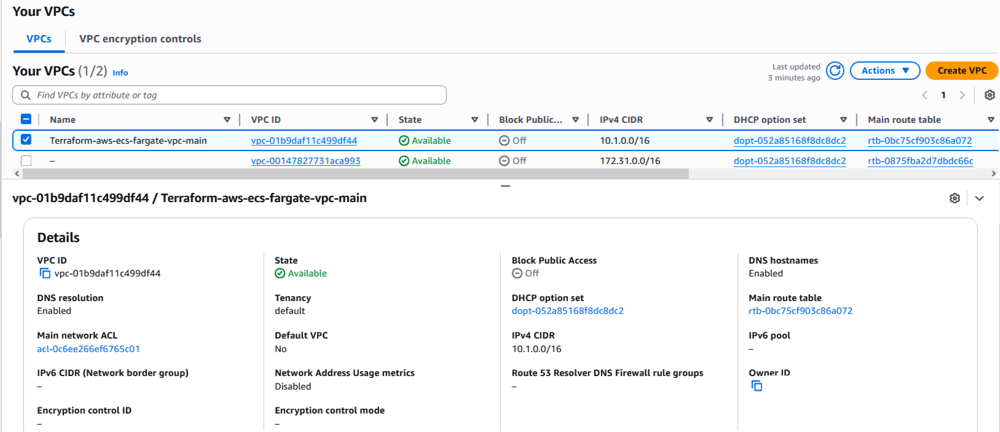

The VPC resource map shows the complete network topology — 6 subnets across 2 availability zones, 4 route tables, and 2 network connections:

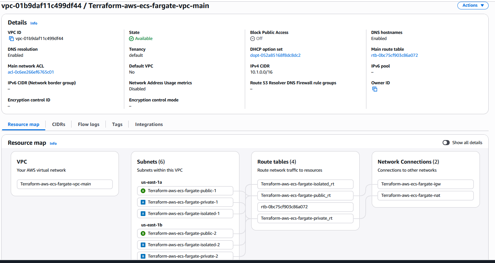

### Route Tables

Three separate route tables enforce the isolation between tiers. The isolated route table deliberately has no routes, which is what makes the database truly unreachable from the internet regardless of any other configuration:

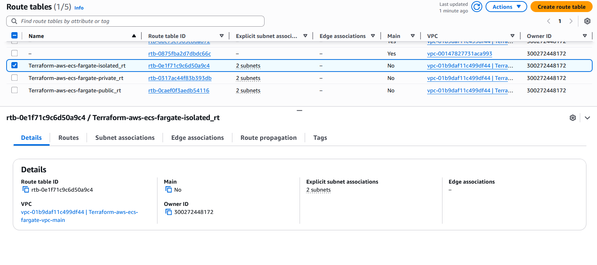

### Internet Gateway

The Internet Gateway is attached to the VPC and referenced by the public route table. It is what gives the ALB its ability to receive traffic from the public internet:

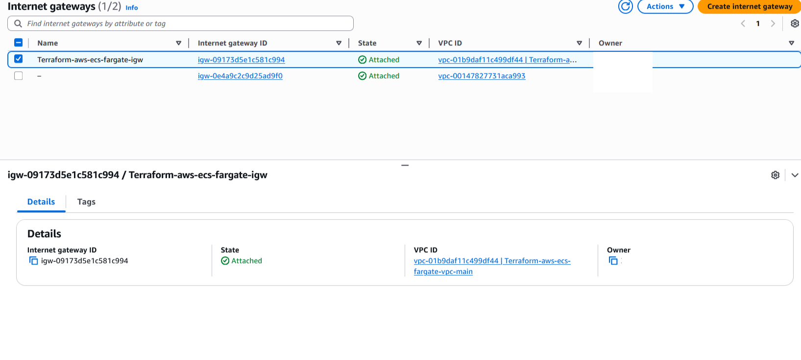

### NAT Gateway

The NAT Gateway sits in the public subnet with an Elastic IP. Private subnets route outbound traffic through it. This allows ECS tasks to reach ECR to pull their Docker images without having a public IP themselves — the privacy is preserved because only outbound connections initiated from inside are allowed:

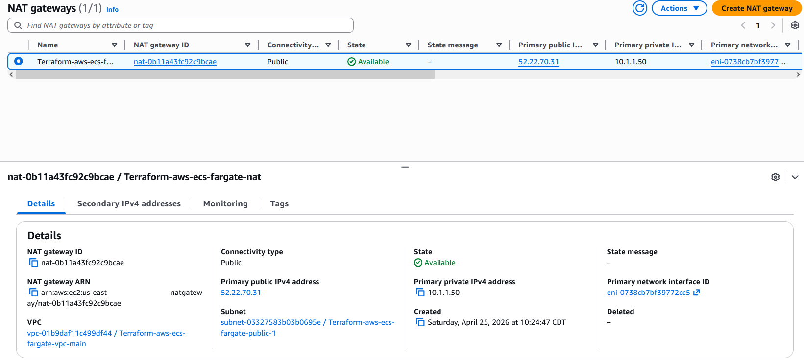

---

## Security Groups

Security groups in this project use a pattern called **security group chaining**. Instead of specifying CIDR ranges in the rules, the rules reference other security groups as the source or destination. This is more secure because it means only resources explicitly assigned that security group can communicate — not just anything that happens to be in the same subnet.

The security groups were written as separate `aws_security_group_rule` resources rather than inline ingress/egress blocks. This was necessary to avoid a circular dependency error — the ALB security group needed to reference ECS, ECS needed to reference ALB and RDS, and RDS needed to reference ECS. Terraform couldn't determine which one to create first. Separating the rules from the groups breaks the cycle by creating the empty groups first and attaching rules after.

### ALB Security Group

The ALB accepts inbound traffic on ports 80 and 443 from the entire internet. It only sends outbound traffic on port 5000 to the ECS security group:

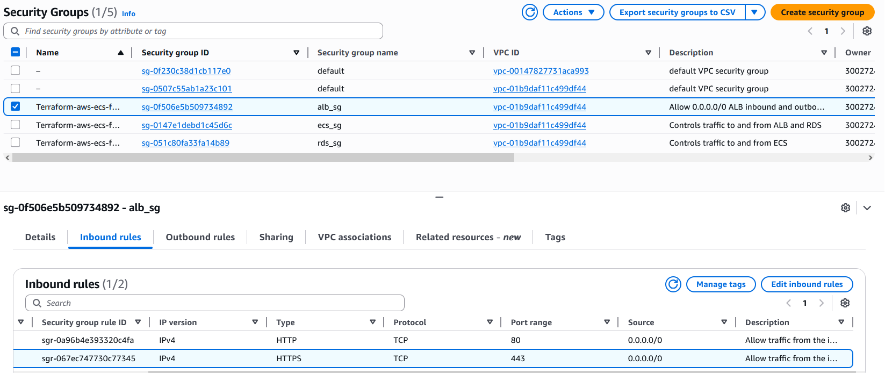

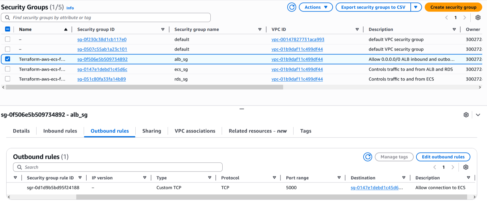

### ECS Security Group

ECS tasks accept inbound traffic on port 5000 from the ALB security group only. They send outbound traffic on port 443 to the internet for ECR image pulls, and on port 5432 to the RDS security group:

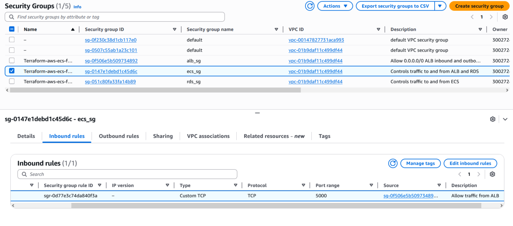

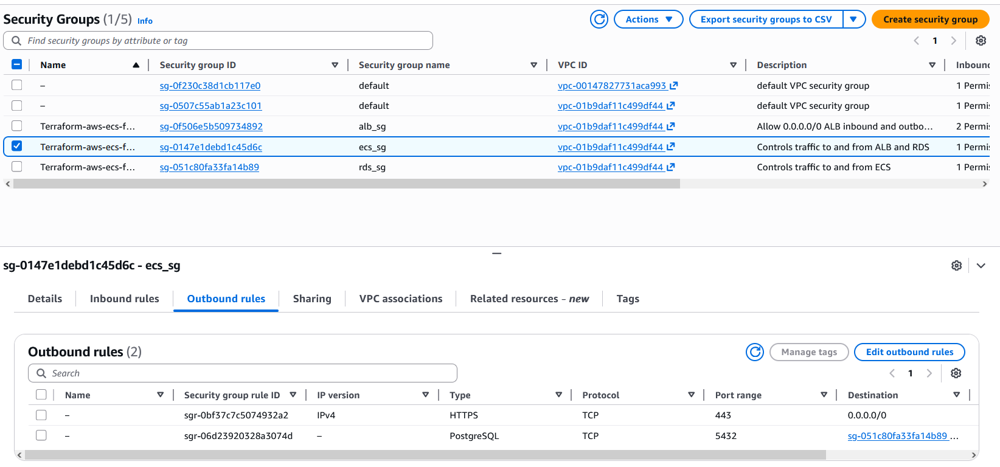

### RDS Security Group

The database accepts inbound traffic on port 5432 from the ECS security group only. No outbound rules exist because RDS never initiates connections — it only responds to connections initiated by ECS:

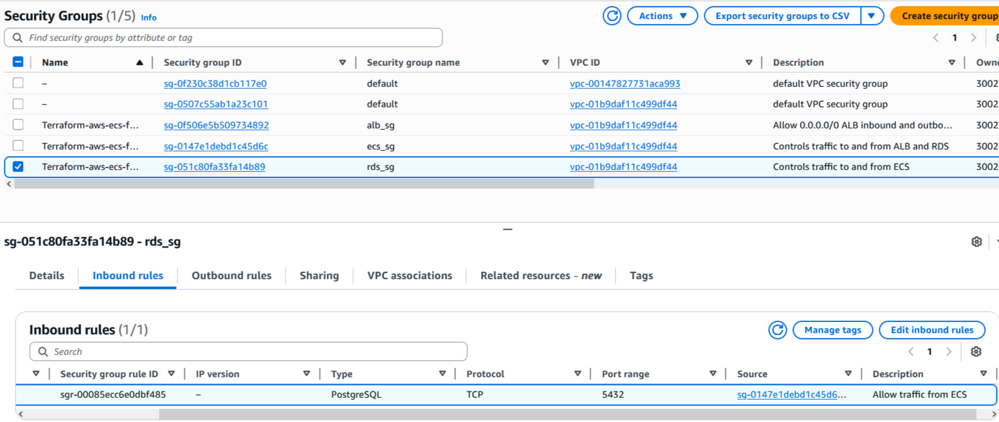

---

## Application Load Balancer

The ALB is the only publicly-facing entry point into the application. It lives in both public subnets across two availability zones, meaning if one AZ goes down the ALB continues serving traffic from the other. It has a single listener on port 80 that forwards all traffic to the ECS target group.

The target group is where the connection between the ALB and ECS happens. When ECS starts a task, the service automatically registers that task's private IP address and port 5000 into the target group. When a task stops, it is automatically deregistered. The ALB then distributes traffic across all registered healthy tasks using round robin. The target group runs a health check every 35 seconds against the `/health` endpoint — tasks that fail 3 consecutive checks are removed from rotation and ECS replaces them.

The target group uses `target_type = "ip"` rather than the default `instance` because Fargate tasks don't run on EC2 instances. They have no instance ID — they only have a private IP address assigned when the task starts.

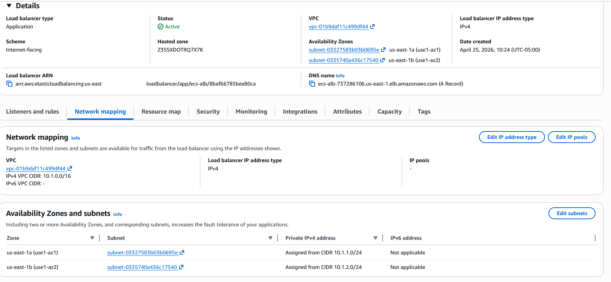

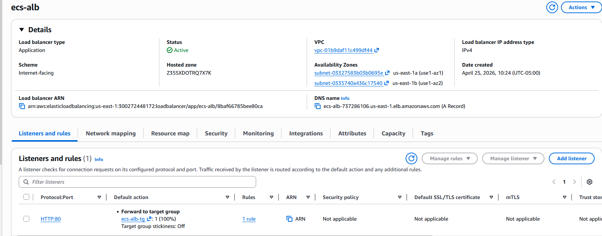

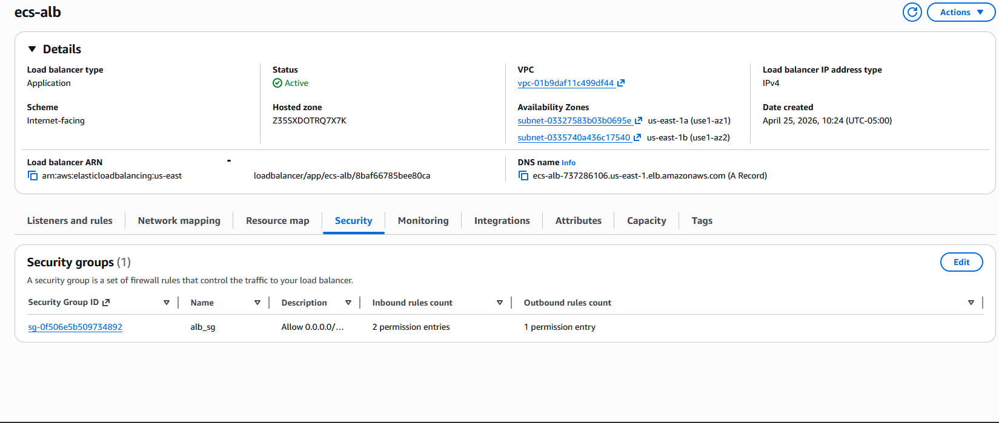

The ALB monitoring tab shows the request count and response time spike during the load test, proving traffic is flowing through the load balancer and reaching the ECS tasks:

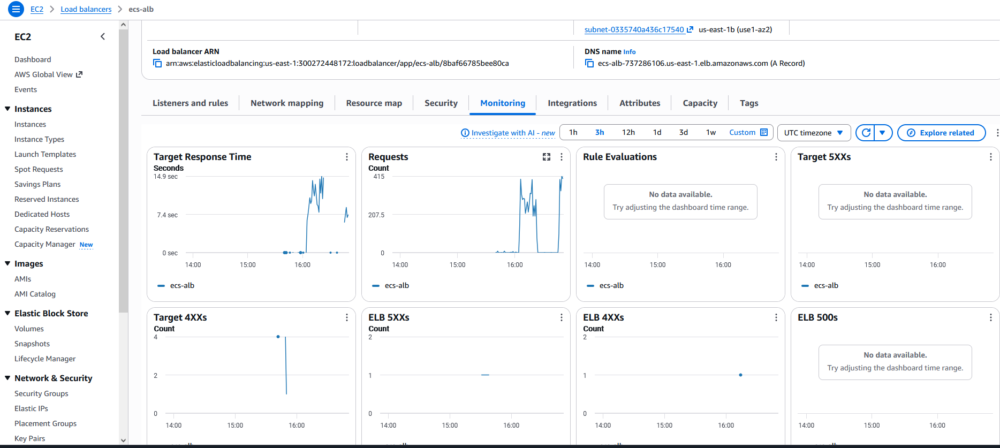

Health check logs are stored in S3. The `ELBHealthCheckLogTestFile` confirms the S3 bucket policy is correctly configured and the ALB has write permission to the bucket:

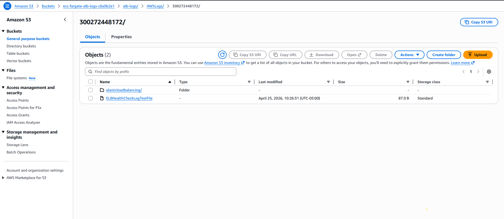

---

## Secrets Management

One of the main security concerns in any application that connects to a database is how the password gets from where it is generated to where it is used without ever being hardcoded anywhere. This project handles it by generating the password with Terraform's `random_password` resource, storing it in AWS Secrets Manager, and having each consumer fetch it in the way that makes most sense for their context.

The password is generated with `override_special = "!#$%&*()-_=+[]{}?"` to exclude characters that RDS doesn't accept — specifically `/`, `@`, `"`, and spaces. This was discovered through a failed apply that returned an `InvalidParameterValue` error when the password contained an `@` character.

RDS receives the password directly as a module output at apply time — Terraform passes it as a variable. This is safe because Terraform marks it as sensitive, meaning it never appears in plan output or logs.

ECS receives only the ARN of the secret. When a Fargate task starts, the ECS agent uses the execution role to call Secrets Manager and inject the value as an environment variable inside the container. The application code reads it with `os.environ["DB_PASSWORD"]`. The password never appears in the task definition, never appears in CloudWatch logs, and is never visible to anyone with ECS console access.

---

## RDS PostgreSQL Multi-AZ

The database runs in isolated subnets with Multi-AZ enabled. AWS maintains a synchronous standby replica in a second availability zone. If the primary fails, AWS automatically promotes the standby — the application reconnects to the same endpoint and continues working. This happens without any Terraform or manual intervention.

The storage uses `gp3` rather than the older `gp2` — newer, faster, and cheaper. Encryption is enabled at rest. Automated backups are retained for 7 days. The deletion protection and final snapshot settings are set for portfolio use — in production both would be reversed.

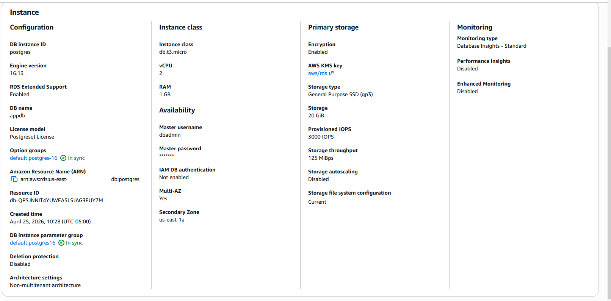

The connectivity tab confirms the database has no internet access gateway and IAM authentication is disabled — only password authentication via the ECS security group is permitted:


RDS monitoring shows database connections and disk activity increasing during the stress test, confirming the full three-tier chain is working end to end:

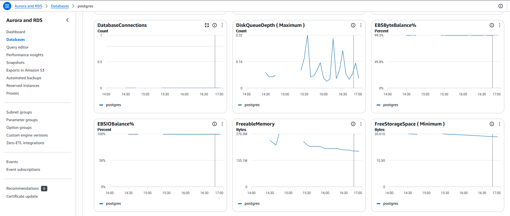

---

## ECS Fargate

Fargate is AWS's serverless container runtime. Instead of provisioning EC2 instances and installing Docker, you define what the container needs — CPU, memory, image, environment variables — and AWS places it and runs it. There are no instances to patch, no capacity to plan, and no ECS agent to manage.

The task definition is the blueprint. It defines the container image from ECR, 256 CPU units (0.25 vCPU), 512 MB of memory, the port mapping on port 5000, the environment variables for the database connection, the secret ARN for the password, and the CloudWatch log configuration. Every time the task definition is updated, AWS creates a new revision. The service can be updated to point to the new revision with zero downtime using a rolling deployment.

The service is what keeps tasks running. It maintains a desired count of 2 tasks at all times. If a task crashes, the service starts a replacement. If a task fails health checks, the ALB stops sending traffic to it and the service eventually replaces it. When a task starts, the service registers its IP into the ALB target group. When it stops, it deregisters.

Two IAM roles are attached to the task definition. The execution role is used by the ECS agent to pull the image from ECR, fetch the secret from Secrets Manager, and write logs to CloudWatch. The task role is used by the application code itself at runtime. Separating them follows least-privilege — the application doesn't need to pull ECR images, and the ECS agent doesn't need to call whatever AWS services the application might call.

2 tasks running on task definition `app:3`, both in `Running` state:

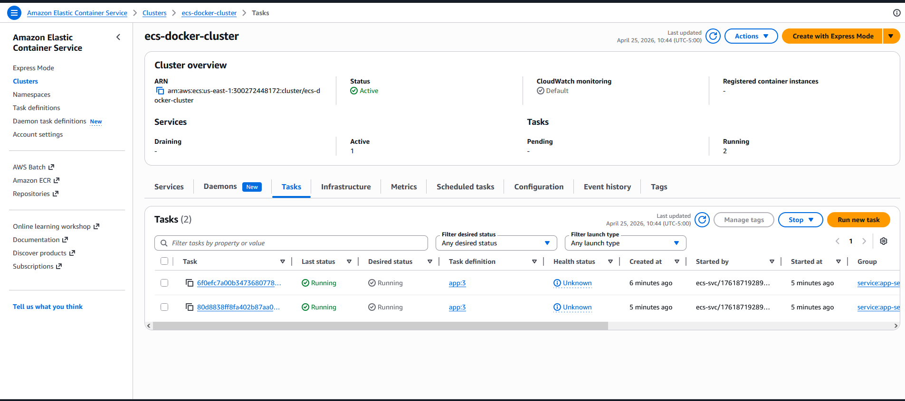

Normal operating state — 2 healthy targets, CPU at ~4%, memory at ~4.3%:

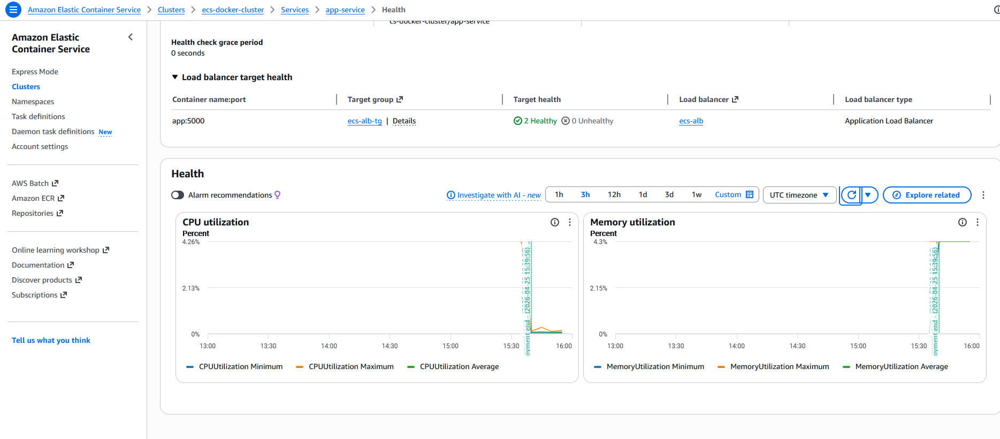

---

## Auto Scaling Under Load

Auto scaling is configured with `aws_appautoscaling_target` and `aws_appautoscaling_policy` using target tracking. The policy watches `ECSServiceAverageCPUUtilization` and tries to maintain it at 60%. When CPU rises above 60%, it adds tasks up to the maximum of 4. When CPU drops below 60%, it removes tasks down to the minimum of 2. Both directions have a 60 second cooldown to prevent thrashing.

To actually trigger auto scaling, a `/stress` endpoint was added to the Flask app that performs 1 million CPU-intensive calculations per request. A load test using Apache Benchmark (`ab`) sends 5000 requests with 50 concurrent connections to this endpoint. This generates enough sustained CPU pressure to push past the 60% threshold and trigger the scaling policy.

### Stress Test — CPU Spike

CPU maximum hits 100%, average climbs above 60%, auto scaling triggers and a third task deployment begins. The service shows 3 Completed tasks in the deployment state:


### Stress Test — Third Task Healthy

3 healthy targets are registered in the ALB target group. The CPU spike is still visible, confirming the new task came up while load was still running and immediately started receiving traffic:

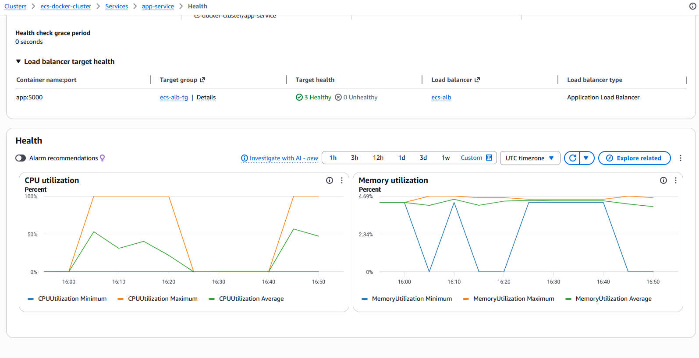

### Full Stress Cycle

Two complete stress test runs captured — CPU spikes to 100% maximum, the average climbs above 50%, then drops back to 0% when the test ends. The memory minimum line dips during scaling events as new tasks are provisioned and old ones drain:

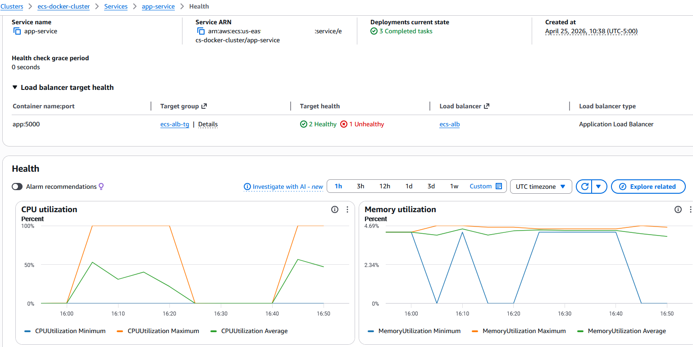

---

## Automated Docker Image Push

One of the problems with any IaC project that involves containers is the chicken-and-egg issue — ECS needs an image in ECR before it can start tasks, but the ECR repository doesn't exist until Terraform creates it. The standard approach is to run `terraform apply` first for ECR, then push the image manually, then run `terraform apply` again for everything else.

This project solves it with a `terraform_data` resource in the ECR module that runs a `local-exec` provisioner. When Terraform creates the ECR repository, this resource immediately runs three shell commands — authenticate Docker to ECR, build the image from the `app/` directory, and push it with the specified tag. By the time ECS tries to pull the image, it already exists. One `terraform apply` deploys everything.

---

## Lessons Learned

**Secrets Manager recovery window** — After `terraform destroy`, the secret is not immediately deleted. Secrets Manager schedules it for deletion with a 30 day recovery window. Running `terraform apply` again immediately fails because the name is taken. For portfolio projects where you destroy and recreate frequently, setting `recovery_window_in_days = 0` avoids this. In production, keep the 30 day window as protection against accidental deletion.

**RDS password race condition** — The original design had the RDS module read the password from Secrets Manager using a `data.aws_secretsmanager_secret_version` data source. This caused intermittent failures where Terraform tried to read the secret version in the same apply that created it, before it was fully propagated. The fix was to remove the data source entirely and pass the password directly from the secrets module output as a variable. Terraform's dependency graph guarantees the password value is available before the RDS resource is created.

**Security group circular dependency** — Writing security groups with inline ingress/egress blocks where ALB references ECS, ECS references ALB and RDS, and RDS references ECS causes a cycle error — Terraform cannot determine which resource to create first. The fix is to create empty security groups first using separate `aws_security_group` resources, then attach rules using individual `aws_security_group_rule` resources that reference the already-created groups.

**RDS endpoint vs address** — `aws_db_instance.endpoint` returns `host:port` as a combined string like `postgres.xxx.us-east-1.rds.amazonaws.com:5432`. Using this directly as `DB_HOST` caused a DNS resolution error because the port was included in the hostname. The fix is to use `aws_db_instance.address` which returns only the hostname.

---

## Application Endpoints

| Endpoint | Response | Purpose |
|----------|---------|---------|
| `GET /` | `{"message": "Hello from ECS!"}` | Confirms app is running |
| `GET /health` | `{"status": "healthy"}` | ALB health check target |
| `GET /db` | `{"status": "database connected"}` | Confirms RDS connectivity |
| `GET /stress` | `{"result": ..., "status": "done"}` | CPU intensive endpoint for load testing |

---

## Deployment

### Prerequisites
- AWS CLI configured with appropriate credentials
- Terraform >= 1.7
- Docker installed and running

### 1. Bootstrap — run once, manually

```bash
cd bootstrap
terraform init
terraform apply
```

### 2. Deploy all infrastructure

The Docker image is built and pushed to ECR automatically as part of this step.

```bash
cd infra
terraform init
terraform apply
```

### Test

```bash
terraform output alb_dns_name

curl http://<alb_dns_name>/
curl http://<alb_dns_name>/health
curl http://<alb_dns_name>/db
```

### Load Test

```bash
sudo apt install -y apache2-utils
ab -n 5000 -c 50 http://<alb_dns_name>/stress
```

Watch tasks scale: AWS Console → ECS → Clusters → ecs-docker-cluster → Tasks

### Destroy

```bash
terraform destroy
```

---

## Production Considerations

This project is designed as a portfolio demonstration. The following changes would be made for a production deployment:

| Setting | This Project | Production |
|---------|-------------|------------|
| HTTPS | HTTP port 80 | HTTPS port 443 with ACM certificate |
| HTTP | forwards to ECS | redirects to HTTPS (301) |
| `deletion_protection` | `false` | `true` |
| `skip_final_snapshot` | `true` | `false` |
| `recovery_window_in_days` | `0` | `30` |
| Auto scaling max | 4 tasks | based on load testing |
| RDS instance | `db.t3.micro` | `db.t3.medium` or larger |
| CloudWatch retention | 7 days | 30-90 days |
| Domain | ALB auto-generated DNS | Custom domain via Route 53 + ACM |

---

## Cost Estimate (us-east-1)

| Resource | Cost |
|----------|------|
| NAT Gateway | ~$0.045/hr |
| RDS db.t3.micro Multi-AZ | ~$0.036/hr |
| ALB | ~$0.008/hr |
| ECS Fargate 2 tasks | ~$0.010/hr |
| Secrets Manager | ~$0.40/month |
| **Total** | **~$0.10/hr (~$2.40/day)** |

> Destroy resources after testing to avoid unnecessary charges.

---

## Intended Audience

This project is intended to demonstrate containerized infrastructure and cloud networking capabilities for roles such as Cloud Engineer, DevOps Engineer, or Platform Engineer. It shows the ability to design a multi-tier network with proper isolation, deploy containerized workloads on managed compute, manage secrets securely without hardcoding credentials, configure auto scaling based on real metrics, and build production-pattern infrastructure entirely from code.
